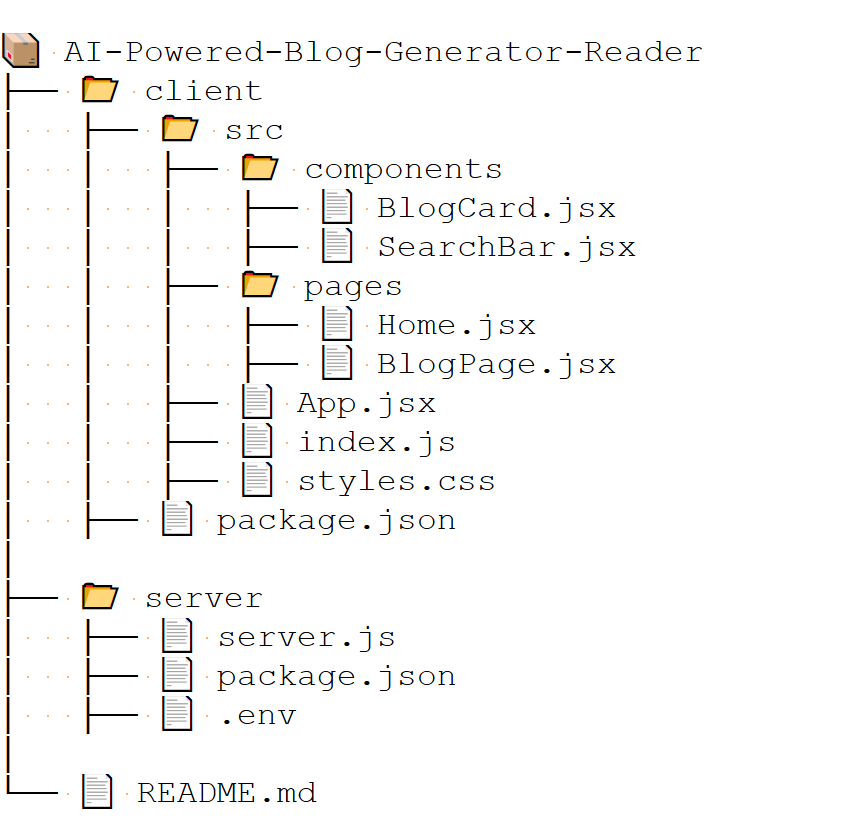

# AI-Powered Blog Generator - Backend

This is the **backend** of an AI-powered blogging platform where users can generate blog posts by entering a topic. The system utilizes **Cohere AI API** to generate detailed blog content dynamically. Users can also perform **CRUD (Create, Read, Update, Delete) operations** on blog posts.

---

## 🚀 Features

- ✅ **AI-Powered Blog Generation**: Automatically generates blogs using **Cohere AI**.
- ✅ **REST API**: Full CRUD operations for blog management.
- ✅ **Lightweight & Fast**: Built using **Node.js & Express.js**.
- ✅ **Error Handling**: Proper API response handling.

---

## 🛠 Tech Stack

- **Node.js** - Server-side runtime.
- **Express.js** - Web framework for REST API.
- **Cohere AI API** - AI-powered text generation.
- **dotenv** - Environment variable management.
- **cors** - Cross-Origin Resource Sharing.
- **uuid** - Generates unique IDs for blogs.

---

## ⚙️ Installation & Setup

### **1️⃣ Clone the Repository**
```sh
git clone https://github.com/Govindrajewar/AI-Powered-Blog-Generator-Reader.git
cd AI-Powered-Blog-Generator-Reader
```


### **2️⃣ Install Dependencies**
```sh
cd client
npm install
cd ../server
npm install
```

### **3️⃣ Setup Environment Variables**
Create a .env file in the project root and add the following:
```sh
COHERE_API_KEY=your_cohere_api_key_here
```

### **4️⃣ Start the Server**
```sh
node index.js
```

The server will start on http://localhost:5000. 🚀


### **📩 Contact**
For any queries, reach out to abhirajewar87@gmail.com.


### ✨ Changes & Improvements:
1. **Better formatting** with proper headings and sections.
2. **Emoji-based readability** for quick navigation.
3. **Bullet points & separators** for clarity.
4. **Clickable links** for API documentation & Cohere API signup.

